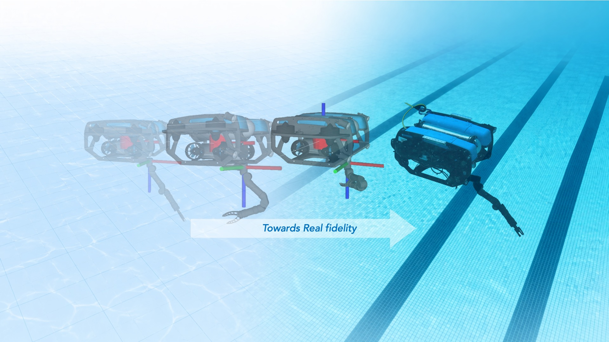

UVMS Project Documentation
==========================

This documentation covers the underwater vehicle-manipulator simulator and the
SimLab runtime tooling as one ROS 2 UVMS stack. The stack combines simulator
hardware interfaces, robot descriptions, controllers, planners, replay tools,
camera/perception utilities, logging, and hardware-in-the-loop workflows.

.. toctree::
   :maxdepth: 2
   :caption: Guides

   simlab_overview
   installation
   userdoc
   hil_setup
   services_and_interfaces
   controls_and_menus
   replay_and_experiments
   camera_and_perception
   hacking_guide

.. toctree::
   :maxdepth: 1
   :caption: Project Links

   GitHub: uvms-simulator <https://github.com/edxmorgan/uvms-simulator>
   GitHub: uvms-simlab <https://github.com/edxmorgan/uvms-simlab>
   GitHub: floating-KinDyn <https://github.com/edxmorgan/floating-KinDyn>
   GitHub: diff_uv <https://github.com/edxmorgan/diff_uv>
